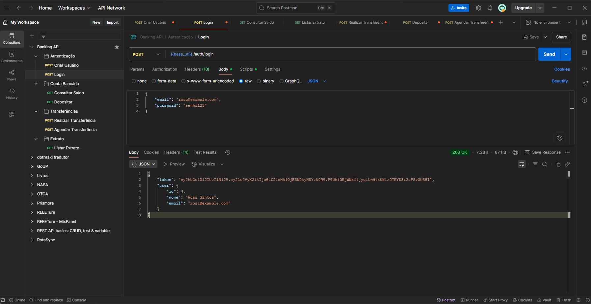
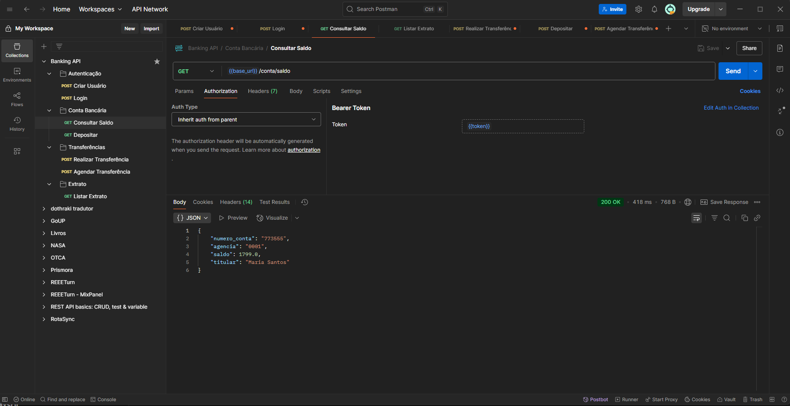
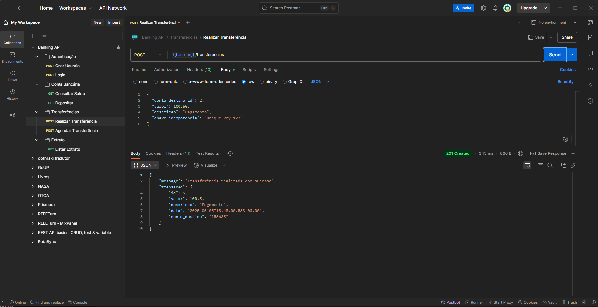

# API Bancária Segura

API REST desenvolvida em Ruby on Rails que simula operações bancárias básicas com autenticação JWT, controle de concorrência e processamento assíncrono.

## 🚀 Tecnologias Utilizadas

- **Ruby 3.2.8**
- **Rails 7.1.5**
- **PostgreSQL 15**
- **Redis** (para Sidekiq)
- **JWT** (autenticação)
- **Sidekiq** (processamento assíncrono)
- **Docker & Docker Compose**
- **bcrypt** (hash de senhas)
- **cpf_cnpj** (validação de CPF)

## 📋 Funcionalidades Implementadas

### ✅ Funcionalidades Obrigatórias
- **Autenticação JWT** com tokens Bearer
- **Cadastro de usuários** com validação de CPF e e-mail único
- **Criação automática de conta bancária** ao cadastrar usuário
- **Consulta de saldo** 
- **Transferências PIX** com validação de saldo
- **Extrato bancário** com filtros (data, valor mínimo, tipo)
- **Agendamento de transferências** via Sidekiq
- **Controle de concorrência** com locks otimistas
- **Proteção contra transferências duplicadas** (idempotência)

### 🌟 Diferenciais Implementados
- ✅ **Validação de CPF** no cadastro
- ✅ **Paginação no extrato** (Kaminari)
- ✅ **Docker e Docker Compose**
- ✅ **Logs de auditoria** completos
- ✅ **Depósitos** via endpoint próprio
- ✅ **Documentação Postman** (collection incluída)

## 🏗️ Arquitetura e Decisões Técnicas

### 1. **Autenticação e Segurança**
- JWT com expiração de 24 horas
- Senhas armazenadas com bcrypt (cost 12)
- Todas as rotas protegidas validam o token
- CPF armazenado com máscara para facilitar visualização

### 2. **Controle de Concorrência**
- Uso de `with_lock` para operações de saldo
- Transações SQL para garantir atomicidade
- Validações de saldo antes de debitar

### 3. **Processamento Assíncrono**
- Sidekiq para transferências agendadas
- Redis como backend de filas
- Job que verifica transferências pendentes a cada minuto

### 4. **Auditoria e Logs**
- Registro de todas as ações importantes
- IP e User-Agent salvos para rastreabilidade
- Enum para tipos de ação padronizados

### 5. **Service Objects**
- `TransferenciaService` para centralizar lógica de transferências
- Facilita testes e manutenção do código

## 🐳 Setup com Docker

### Pré-requisitos
- Docker Desktop instalado
- Git

### Instalação

1. Clone o repositório:
```bash
git clone <repositorio>
cd api-bancaria
```

2. Inicie os containers:
```bash
docker-compose up -d
```

3. Crie o banco de dados:
```bash
docker-compose exec web rails db:create db:migrate
```

4. (Opcional) Crie dados de teste:
```bash
docker-compose exec web rails db:seed
```

A API estará disponível em `http://localhost:3000`

### Serviços rodando:
- **API**: http://localhost:3000
- **PostgreSQL**: localhost:5432
- **Redis**: localhost:6379
- **Sidekiq Web**: http://localhost:3000/sidekiq (apenas em desenvolvimento)

## 🧪 Como Testar

### 1. Criar um usuário
```bash
POST http://localhost:3000/api/v1/users
Content-Type: application/json

{
  "user": {
    "nome": "João Silva",
    "email": "joao@example.com",
    "password": "senha123",
    "password_confirmation": "senha123",
    "cpf": "11144477735"
  }
}
```

### 2. Fazer login
```bash
POST http://localhost:3000/api/v1/auth/login
Content-Type: application/json

{
  "email": "joao@example.com",
  "password": "senha123"
}
```
Resposta incluirá o token JWT.

### 3. Realizar um depósito (usar o token do login)
```bash
POST http://localhost:3000/api/v1/conta/deposito
Authorization: Bearer SEU_TOKEN_AQUI
Content-Type: application/json

{
  "valor": 1000.00
}
```

### 4. Fazer uma transferência
```bash
POST http://localhost:3000/api/v1/transferencias
Authorization: Bearer SEU_TOKEN_AQUI
Content-Type: application/json

{
  "conta_destino_id": 2,
  "valor": 100.50,
  "descricao": "Pagamento",
  "chave_idempotencia": "unique-key-123"
}
```

### 5. Consultar extrato
```bash
GET http://localhost:3000/api/v1/extrato?data_inicio=2025-01-01&data_fim=2025-12-31
Authorization: Bearer SEU_TOKEN_AQUI
```

## 📡 Endpoints da API

| Método | Endpoint | Descrição | Autenticação |
|--------|----------|-----------|--------------|
| POST | `/api/v1/users` | Criar usuário | ❌ |
| POST | `/api/v1/auth/login` | Login | ❌ |
| GET | `/api/v1/conta/saldo` | Consultar saldo | ✅ |
| POST | `/api/v1/conta/deposito` | Realizar depósito | ✅ |
| POST | `/api/v1/transferencias` | Realizar transferência | ✅ |
| POST | `/api/v1/transferencias/agendada` | Agendar transferência | ✅ |
| GET | `/api/v1/extrato` | Listar extrato | ✅ |

### Parâmetros do Extrato
- `data_inicio` (opcional): Data inicial do filtro
- `data_fim` (opcional): Data final do filtro
- `valor_minimo` (opcional): Valor mínimo das transações
- `tipo` (opcional): `enviadas`, `recebidas` ou `todas`
- `page` (opcional): Página para paginação
- `per_page` (opcional): Itens por página (padrão: 20)

## 📄 Collection do Postman

A collection completa do Postman está incluída no repositório:
- Arquivo: `API_Bancaria.postman_collection.json`
- Inclui todos os endpoints com exemplos
- Variáveis de ambiente para facilitar os testes

### Como importar no Postman:
1. Abra o Postman
2. Clique em "Import"
3. Selecione o arquivo `API_Bancaria.postman_collection.json`
4. Configure a variável `{{token}}` após fazer login

## 🔍 Comandos Úteis

```bash
# Ver logs da aplicação
docker-compose logs -f web

# Acessar o console Rails
docker-compose exec web rails console

# Ver jobs do Sidekiq
docker-compose exec web rails c
Sidekiq::Queue.new.size

# Executar rubocop
docker-compose exec web rubocop

# Parar todos os containers
docker-compose down
```

## 💡 O que faria com mais tempo

1. **Testes com RSpec**
   - Testes unitários para models e services
   - Testes de integração para controllers
   - Testes de jobs do Sidekiq

2. **Documentação com Swagger**
   - Documentação interativa da API
   - Schemas de request/response

3. **Melhorias de segurança**
   - Rate limiting para prevenir ataques
   - 2FA (autenticação de dois fatores)
   - Refresh tokens

4. **Features adicionais**
   - Notificações por e-mail/SMS
   - Histórico de login
   - Dashboard com estatísticas
   - Cancelamento de transferências agendadas
   - QR Code para transferências

5. **Performance**
   - Cache com Redis
   - Índices otimizados no banco
   - APM (Application Performance Monitoring)

## 📸 Screenshots

### Resposta de Login Bem-sucedido


### Consulta de Saldo


### Transferência Realizada


## 👨‍💻 Autor
Benjamin Vieira
[Linkedin](https://www.linkedin.com/in/garbkrit/)
[Email](mailto:garbkrit@gmail.com)  

---

Desenvolvido como parte do processo seletivo para a vaga de desenvolvedor back-end.